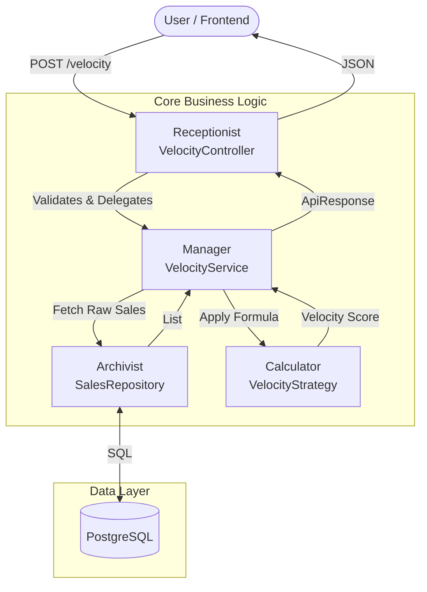

## Project Overview

**Velosales** acts as a backend utility for a larger inventory system. It solves a specific business problem: **"How fast are products selling?"**

Instead of a monolithic approach, this service uses a decoupled architecture to ensure scalability and maintainability. It is designed to accept sales data batches and return stock velocity metrics using configurable calculation strategies.

---

## Architecture & Design

I followed the **Separation of Concerns** principle, ensuring each component has a single responsibility. This makes the codebase easy to read and maintain.

### The "Office" Analogy
To understand the flow, visualize the service as an office hierarchy:

1.  **The Receptionist (`VelocityController`)**: The entry point. Validates requests and delegates work.
2.  **The Manager (`VelocityService`)**: Orchestrates the flow. Fetches data and selects the math strategy.
3.  **The Archivist (`SalesRepository`)**: Handles raw data retrieval from the database.
4.  **The Calculator (`VelocityStrategy`)**: A polymorphic interface for business logic (Math).

### System Flow Diagram

